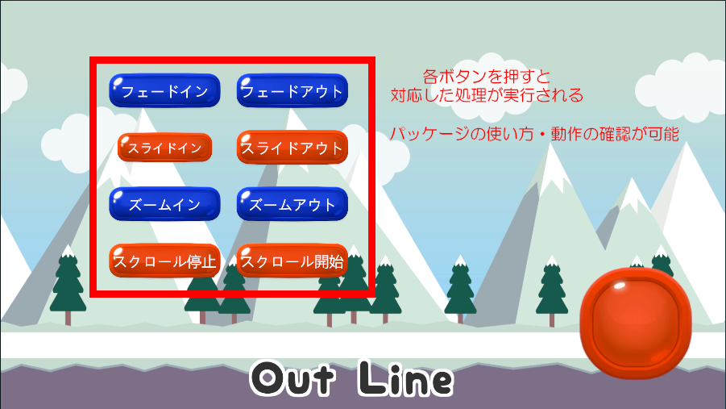
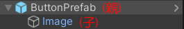
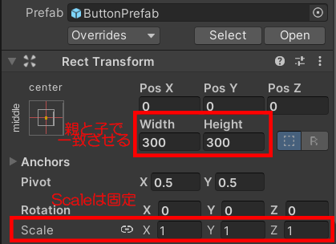

# 目次
- ライブラリ概要
  1. [概要](#ライブラリ概要)
  2. [パッケージ一覧](#2-パッケージ一覧)
  3. [デモシーンの説明](#3-デモシーンuidemosceneの説明)
- 各パッケージ使用方法
  1. [完全版パッケージ](#1-完全版パッケージ)
  2. [ボタンアニメーション](#2-ボタンアニメーション)
  3. [パネルアニメーション ズーム](#3-パネルアニメーション-ズーム)
  4. [パネルアニメーション スライド](#4-パネルアニメーション-スライド)
  5. [フェードイン・アウト](#5-フェードイン・アウト)
  6. [背景のループ](#6-背景のループ)
  7. [タップエフェクト・ロングタップエフェクト](#7-タップエフェクト・ロングタップエフェクト)
  8. [テキストのアウトライン](#8-テキストのアウトライン)

 

# ライブラリ概要
## 1. 概要
- 汎用化された**UIのアニメーションや演出**を、プレファブやマネージャーを用いて簡単に使用できるライブラリです。
- 各クラスにおいて必要な変数をインスペクタ上で指定できるように設計されています。 各パッケージの詳しい使い方については[こちら](#各パッケージ使用方法)から参照してください。
#### クラス名について
- 〇〇Manager.cs ： 空のオブジェクトにアタッチして使用
- 〇〇Animation.cs： ボタンやパネル等、適宜使用するUIにアタッチして使用
 

## 2. パッケージ一覧
| パッケージ名 | 内容 | 備考 |
| ---| ---| ---|
| 完成版パッケージ名 | 以下のすべてのパッケージを含むパッケージ | - |
| ButtonAnimationPackage | ボタンの拡大縮小アニメーションを行うためのクラス、プレファブを含むパッケージ | パッケージに含まれる **Buttonプレファブ** をヒエラルキー上に ドラッグアンドドロップでスムーズに使用できます。 使用方法は[こちら](#1-ボタンアニメーション) |
| ZoomAnimationPackage | パネル等のズームイン・アウトアニメーションを行うためのクラスを含むパッケージ | 使用方法は[こちら](#2-パネルアニメーション-ズーム) |
| SlideAnimationPackage | パネル等のスライドイン・アウトアニメーションを行うためのクラスを含むパッケージ | 使用方法が複雑なため、必ず[使用時の注意点](#3-パネルアニメーション-スライド)を参照してください。 使用方法は[こちら](#3-パネルアニメーション-スライド) |
| FadePackage | フェードイン・アウト演出を行うためのクラスを含むパッケージ | 使用方法は[こちら](#4-フェードインアウト) |
| BgLoopPackage | 背景のループを行うためのクラスを含むパッケージ | 使用方法が複雑なため、必ず[使用時の注意点](#5-背景のループ)を参照してください。 使用方法は[こちら](#5-背景のループ) |
| TapEffectPackage | タップエフェクト・ロングタップエフェクト演出を行うためのクラス、プレファブを含むパッケージ | 使用方法は[こちら](#6-タップエフェクトロングタップエフェクト) |
| TextOutLinePackage | テキストにアウトラインを付けるためのクラスを含むパッケージ | 使用方法は[こちら][def] |
 

## 3. デモシーン(UIDemoScene)の説明
- 完全版パッケージに含まれていて、各パッケージの使い方や動作を確認できます。

 
 

# 各パッケージ使用方法

## 1. 完全版パッケージ
### 内容物・ディレクトリ構造について
- Assets
  - Resources
    - Images
    - Prefabs
  - Scripts
    - Animation
    - Manager
    - UI
  - Scene

## 2. ボタンアニメーション
- カーソルを合わせた時に縮小・離れた時に拡大するアニメーション
- ソース : **ButtonAnimation.cs**
- プレファブ : **ButtonPrefab**
#### 主な使用方法
1. Resources/Prefabs/**ButtonPrefab**をキャンバス上にドラッグアンドドロップ。
2. ButtonPrefabにアタッチされている、**ButtonAnimation.cs**のスケールの最大値・最小値、アニメーションの速度を設定して使用。(インスペクタ上で設定)

### インスペクタ上で指定する変数について

| 変数名 | 型 | 用途 | 備考 |
| ---| ---| ---| --- |
| maxScale | float | スケールの最大値(拡大時) | 0~1.0の値 |
| minScale | float | スケールの最小値(縮小時) | 0~1.0の値 |
| samples | float | アニメーションの速度 | 0.1~4.0の値 0.1が遅い、4.0が速い |

### 使用時に必要な物
| 必要な物 | アタッチ先 | 備考 |
| ---| ---| ---|
| Buttonプレファブ | - | **ボタンアニメーションを行う場合は、こちらのButtonプレファブを使用しての開発を推奨します。** Buttonプレファブを使用しない場合は、ButtonAnimation.csを使用するImageやPanelにアタッチし、イベントトリガーの設定を行うことで利用可能です。|
| ButtonAnimation.cs | Buttonプレファブの親オブジェクト |  |
| ボタンの画像 | Buttonプレファブの子オブジェクト(Image)の Imageコンポーネント内 Source Image | - |
| Event Trigger(**PointerEnter**) | Buttonプレファブの親オブジェクト | Buttonプレファブを使用する場合は、アタッチ済みのため設定は不要です。  **Buttonプレファブを使用しない場合は、Buttonanimation.cs.ReduceSize()を設定してください。**|
| Event Trigger(**PointerExit**) | Buttonプレファブの親オブジェクト | Buttonプレファブを使用する場合は、アタッチ済みのため設定は不要です。  **Buttonプレファブを使用しない場合は、Buttonanimation.cs.IncreaseSize()を設定してください。**|

### 使用時の注意点
1. **Buttonプレファブの構造について** 
- 拡大縮小時のちらつきを防ぐため、Buttonプレファブは親子構造になっています。
  

  ※ 親でButtonAnimation.csや、イベントトリガーの設定を行います。 
  ※ 子で画像の設定を行います。
 

2. **サイズ設定について**
- ボタンのサイズを変更したい場合はscaleではなくWidthとHeightで調整してください。 (Scaleは固定)
- 親と子のWidthとHeightの値は必ず一致させてください。

 

3. **maxScale、minScaleについて**
- 拡大縮小の値は、必ず **maxScale > minScale** になるように設定してください。

## 3. パネルアニメーション ズーム
- パネル表示・非表示時のアニメーション
- ソース : **ZoomAnimation.cs**
#### 主な使用方法
1. Scripts/**ZoomAnimation.cs**を、アニメーションさせたいパネル等にアタッチ。
2. **ZoomAnimation.cs**のスケールの最大値・最小値、アニメーションの速度、ズームのタイプ、初めからアニメーションを行うかを設定。(インスペクタ上で設定)
3. ズームインを行うタイミングで、**ZoomAnimation.cs.ShowZoomIn()**を呼び出す。 ズームアウトを行うタイミングで、**ZoomAnimation.cs.ShowZoomOut()**を呼び出す。

### インスペクタ上で指定する変数について

| 変数名 | 型 | 用途 | 備考 |
| ---| ---| ---| --- |
| zoomType | enum | ズームタイプ(ズームインかアウトか) | ZoomIn : ズームイン ZoomOut : ズームアウト |
| maxScale | float | スケールの最大値(拡大時) | 0~1.0の値 |
| minScale | float | スケールの最小値(縮小時) | 0~1.0の値 |
| samples | float | アニメーションの速度 | 0.1~4.0の値 0.1が遅い、4.0が速い |

### 使用時に必要な物
| 必要な物 | アタッチ先 | 備考 |
| ---| ---| ---|
| ZoomAnimation.cs | アニメーションさせたいPanel等のオブジェクト |  |
| 画像 | 使用するオブジェクトのImageコンポーネント内 Source Image | 任意 |
| ZoomAnimation.cs.**ShowZoomIn()** | ズームインアニメーションを行うタイミングで呼び出し | ボタン押下時等に呼び出してください。 |
| ZoomAnimation.cs.**ShowZoomOut()** | ズームアウトアニメーションを行うタイミングで呼び出し | ボタン押下時等に呼び出してください。 |

### 使用時の注意点
1. **maxScale、minScaleについて**
- 拡大縮小の値は、必ず **maxScale > minScale** になるように設定してください。

## 4. パネルアニメーション スライド
aaa

## 5. フェードイン・アウト
aaa

## 6. 背景のループ
aaa

## 7. タップエフェクト・ロングタップエフェクト
aaa

## 8. テキストのアウトライン
aaa

