# 目次
- パッケージダウンロード
- ライブラリ概要
  1. [概要](#ライブラリ概要)
  2. [パッケージ一覧](#2-パッケージ一覧)
  3. [デモシーンの説明](#3-デモシーンuidemosceneの説明)
  4. [完全版パッケージについて](#4-完全版パッケージについて)
- 各パッケージ使用方法
  1. [ボタンアニメーション](#1-ボタンアニメーション)
  2. [パネルアニメーション ズーム](#2-パネルアニメーション-ズーム)
  3. [パネルアニメーション スライド](#3-パネルアニメーション-スライド)
  4. [フェードイン・アウト](#4-フェードイン・アウト)
  5. [背景のループ](#5-背景のループ)
  6. [タップエフェクト・ロングタップエフェクト](#6-タップエフェクト・ロングタップエフェクト)
  7. [テキストのアウトライン](#7-テキストのアウトライン)
  8. [スコア表示](#8-スコア表示)
  9. [タイマー表示](#9-タイマー表示)
 
 

# パッケージダウンロード
#### 完全版パッケージのダウンロードは[こちら(https://github.com/Kawahara-Rina/UILibrary/releases/download/v1.0.2/00.UILib.unitypackage)](https://github.com/Kawahara-Rina/UILibrary/releases/download/v1.0.2/00.UILib.unitypackage)
#### 最新版の各パッケージのダウンロードは[こちら(https://github.com/Kawahara-Rina/UILibrary/releases/tag/v1.0.2)](https://github.com/Kawahara-Rina/UILibrary/releases/tag/v1.0.2)

 

# ライブラリ概要
## 1. 概要
- 汎用化された**UIのアニメーションや演出**を、プレファブやマネージャーを用いて簡単に使用できるライブラリです。
- 各クラスにおいて必要な変数をインスペクタ上で指定できるように設計されています。 
  各パッケージの詳しい使い方については[こちら](#各パッケージ使用方法)から参照してください。
  
#### クラス名について
- 〇〇Manager.cs ： 空のオブジェクトにアタッチして使用
- 〇〇Animation.cs： ボタンやパネル等、適宜使用するUIにアタッチして使用
 

## 2. パッケージ一覧
| パッケージ名            | 内容                                                                                | 備考                                                                                                                                                |
| ---                    | ---                                                                                | ---                                                                                                                                                 |
| 00.UILib                  | 以下のすべてのパッケージを含む完全版パッケージ                                         | 内容物の使用方法については、[こちら](#各パッケージ使用方法)から参照してください。 ダウンロードは[こちら(https://github.com/Kawahara-Rina/UILibrary/releases/download/v1.0.2/00.UILib.unitypackage)](https://github.com/Kawahara-Rina/UILibrary/releases/download/v1.0.2/00.UILib.unitypackage)                                                                                                                                                   |
| 01.ButtonAnimationPackage | ボタンの拡大縮小アニメーションを行うためのクラス、プレファブを含むパッケージ              | パッケージに含まれる **Buttonプレファブ** をヒエラルキー上に ドラッグアンドドロップでスムーズに使用できます。 使用方法は[こちら](#1-ボタンアニメーション) |
| 02.ZoomAnimationPackage   | パネル等のズームイン・アウトアニメーションを行うためのクラスを含むパッケージ              | 使用方法は[こちら](#2-パネルアニメーション-ズーム)                                                                                                      |
| 03.SlideAnimationPackage  | パネル等のスライドイン・アウトアニメーションを行うためのクラスを含むパッケージ            | 使用方法が複雑なため、必ず[使用時の注意点](#3-パネルアニメーション-スライド)を参照してください。 使用方法は[こちら](#3-パネルアニメーション-スライド)        |
| 04.FadePackage            | フェードイン・アウト演出を行うためのクラスを含むパッケージ                              | 使用方法は[こちら](#4-フェードイン・アウト)                                                                                                              |
| 05.BgLoopPackage          | 背景のループを行うためのクラスを含むパッケージ                                         | 使用方法が複雑なため、必ず[使用時の注意点](#5-背景のループ)を参照してください。 使用方法は[こちら](#5-背景のループ)                                       |
| 06.TapEffectPackage       | タップエフェクト・ロングタップエフェクト演出を行うためのクラス、プレファブを含むパッケージ | 使用方法は[こちら](#6-タップエフェクト・ロングタップエフェクト)                                                                                            |
| 07.TextOutLinePackage     | テキストにアウトラインを付けるためのクラスを含むパッケージ                              | 使用方法は[こちら](#7-テキストのアウトライン)                                                                                                           |
| 08.ScorePackage           | スコアの表示・加算・減算を行うクラスを含むパッケージ                                    | 使用方法は[こちら](#8-スコア表示)                                                                                                           |
| 09.TimerPackage           | タイマーの表示・停止・開始を行うラスを含むパッケージ                                    | 使用方法は[こちら](#9-タイマー表示)                                                                                                           |
 

## 3. デモシーン(UIDemoScene)の説明
- 完全版パッケージに含まれていて、各パッケージの使い方や動作を確認できます。

 
 

## 4. 完全版パッケージについて
### 内容物・ディレクトリ構造
- Assets
  - Resources
    - UILib 
      - Images
        - TapEffect
      - Prefabs (①)
  - Scripts
    - UILib
      - Animation (②)
      - Manager   (③)
      - Other    (④)
  - Scene
    - DemoScene  (⑤)
  
① ヒエラルキー上にドラッグアンドドロップで使用できるプレファブが格納してあります。 
② ImageやButton、Panel等にアタッチして使用するアニメーションクラスが格納してあります。 
③ 空のオブジェクトにアタッチして使用するマネージャークラスが格納してあります。 
④ Text等UIにアタッチして使用するその他のクラスが格納してあります。 
⑤ 動作確認を行えるデモシーンが格納してあります。 
 

# 各パッケージ使用方法
## 1. ボタンアニメーション
- カーソルを合わせた時に縮小・離れた時に拡大するアニメーション
- ソース : **ButtonAnimation.cs** (Scripts/UILib/Animation/ButtonAnimation.cs)
- プレファブ : **ButtonPrefab**   (Resources/UILib/Prefabs/ButtonPrefab)
- ダウンロード : [https://github.com/Kawahara-Rina/UILibrary/releases/download/v1.0.2/01.ButtonAnimationPackage.unitypackage](https://github.com/Kawahara-Rina/UILibrary/releases/download/v1.0.2/01.ButtonAnimationPackage.unitypackage)

#### 主な使用方法
1. Resources/Prefabs/**ButtonPrefab**をキャンバス上にドラッグアンドドロップ。
2. ButtonPrefabにアタッチされている、**ButtonAnimation.cs**のスケールの最大値・最小値、アニメーションの速度を設定して使用。(インスペクタ上で設定)

### インスペクタ上で指定する変数について
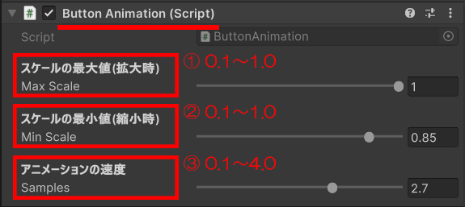 　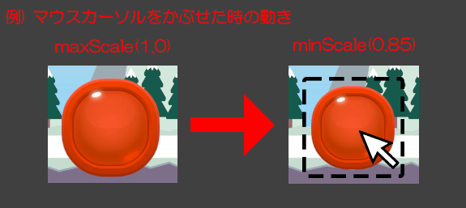

| 変数名    | 型    | 用途                         | 備考                              |
| ---      | ---   | ---                          | ---                               |
| ① maxScale | float | スケールの最大値(拡大時)を指定 | 0~1.0の値                          |
| ② minScale | float | スケールの最小値(縮小時)を指定 | 0~1.0の値                          |
| ③ samples  | float | アニメーションの速度を指定　   | 0.1~4.0の値 0.1が遅い、4.0が速い |

### 使用時に必要な物
| 必要な物 | アタッチ先 | 備考 |
| ---| ---| ---|
| Buttonプレファブ                 | -                                                                           | **ボタンアニメーションを行う場合は、こちらのButtonプレファブを使用しての開発を推奨します。** Buttonプレファブを使用しない場合は、ButtonAnimation.csを使用するImageやPanelにアタッチし、イベントトリガーの設定を行うことで利用可能です。|
| ButtonAnimation.cs              | Buttonプレファブの親オブジェクト                                              | -                                                                                                                                                                                                                         |
| ボタンの画像                     | Buttonプレファブの子オブジェクト(Image)の Imageコンポーネント内 Source Image | 任意                                                                                                                                                                                                                      |
| Event Trigger(**PointerEnter**) | Buttonプレファブの親オブジェクト                                         　　  | Buttonプレファブを使用する場合は、アタッチ済みのため設定は不要です。  **Buttonプレファブを使用しない場合は、Buttonanimation.cs.ReduceSize()を設定してください。**                                                               | 
| Event Trigger(**PointerExit**)  | Buttonプレファブの親オブジェクト                                         　　  | Buttonプレファブを使用する場合は、アタッチ済みのため設定は不要です。  **Buttonプレファブを使用しない場合は、Buttonanimation.cs.IncreaseSize()を設定してください。**                                                             |

### 使用時の注意点
1. **Buttonプレファブの構造について**
- 拡大縮小時のちらつきを防ぐため、Buttonプレファブは親子構造になっています。 
  

  ※ 親でButtonAnimation.csや、イベントトリガーの設定を行います。 
  ※ 子で画像の設定を行います。
 

2. **サイズ設定について**
- ボタンのサイズを変更したい場合はscaleではなくWidthとHeightで調整してください。 
  (Scaleは固定)
- 親と子のWidthとHeightの値は必ず一致させてください。 

 

1. **maxScale、minScaleについて**
- 拡大縮小の値は、必ず 
  **maxScale > minScale** になるように設定してください。

## 2. パネルアニメーション ズーム
- パネル表示・非表示時のズームイン・アウトアニメーション
- ソース : **ZoomAnimation.cs** (Scripts/UILib/Animation/ZoomAnimation.cs)
- ダウンロード : [https://github.com/Kawahara-Rina/UILibrary/releases/download/v1.0.2/02.ZoomAnimationPackage.unitypackage](https://github.com/Kawahara-Rina/UILibrary/releases/download/v1.0.2/02.ZoomAnimationPackage.unitypackage)

#### 主な使用方法
1. Scripts/UILib/Animation/**ZoomAnimation.cs**を、アニメーションさせたいパネル等にアタッチ。
2. **ZoomAnimation.cs**のスケールの最大値・最小値、アニメーションの速度、ズームのタイプ、初めからアニメーションを行うかを設定。(インスペクタ上で設定)
3. ズームインを行うタイミングで、ZoomAnimation.cs.ShowZoomIn()を呼び出す。 
   ズームアウトを行うタイミングで、ZoomAnimation.cs.ShowZoomOut()を呼び出す。

### インスペクタ上で指定する変数について
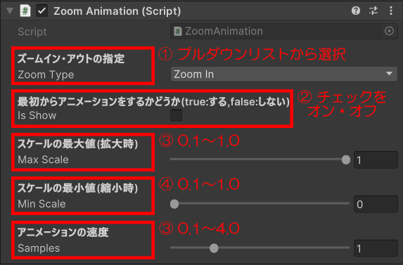　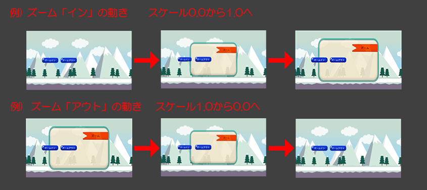
| 変数名    | 型    | 用途                            | 備考                                         |
| ---      | ---   | ---                             | ---                                          |
| ①zoomType | enum  | ズームタイプ(ズームインかアウトか) | ZoomIn : ズームイン ZoomOut : ズームアウト  |
| ②maxScale | float | スケールの最大値(拡大時)          | 0~1.0の値                                    |
| ③minScale | float | スケールの最小値(縮小時)          | 0~1.0の値                                    |
| ④samples  | float | アニメーションの速度              | 0.1~4.0の値 0.1が遅い、4.0が速い           |

### 使用時に必要な物
| 必要な物                        | アタッチ先                                             | 備考                              |
| ---                            | ---                                                   | ---                               |
| ZoomAnimation.cs               | アニメーションさせたいPanel等のオブジェクト               | -                                 |
| 画像                           | 使用するオブジェクトのImageコンポーネント内 Source Image  | 任意                              |
| ZoomAnimation.cs.ShowZoomIn()  | ズームインアニメーションを行うタイミングで呼び出し         | ボタン押下時等に呼び出してください。 |
| ZoomAnimation.cs.ShowZoomOut() | ズームアウトアニメーションを行うタイミングで呼び出し       | ボタン押下時等に呼び出してください。 |

### 使用時の注意点
1. **maxScale、minScaleについて**
- 拡大縮小の値は、必ず 
  **maxScale > minScale** になるように設定してください。

## 3. パネルアニメーション スライド
- パネル表示・非表示時のスライドイン・アウトアニメーション 
  指定した開始座標から指定した停止座標に向けてスライドイン・アウト。
- ソース : **SlideAnimation.cs** (Scripts/UILib/Animation/SlideAnimation.cs)
- ダウンロード : [https://github.com/Kawahara-Rina/UILibrary/releases/download/v1.0.2/03.SlideAnimationPackage.unitypackage](https://github.com/Kawahara-Rina/UILibrary/releases/download/v1.0.2/03.SlideAnimationPackage.unitypackage)

#### 主な使用方法
1. Scripts/UILib/Animation/**SlideAnimation.cs**を、アニメーションさせたいパネル等にアタッチ。
2. **SlideAnimation.cs**のアニメーションの速度、スライドの方向、スライドアウトの動き、スライドイン時の開始・停止位置を設定。(インスペクタ上で設定)
3. スライドインを行うタイミングで、SlideAnimation.cs.SlideIn()を呼び出す。 
   ズームアウトを行うタイミングで、SlideAnimation.cs.SlideOut()を呼び出す。

### インスペクタ上で指定する変数について
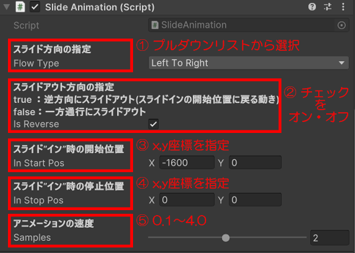　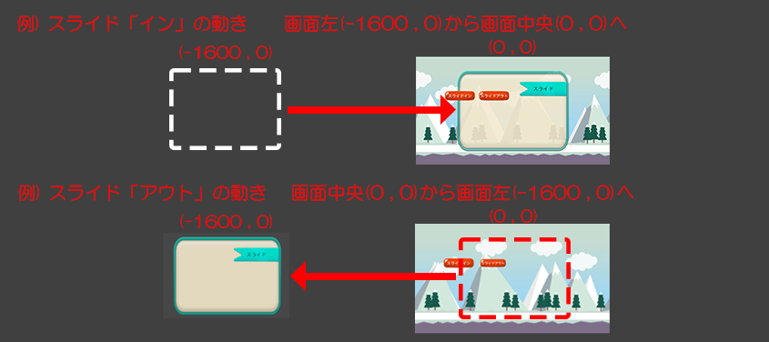
| 変数名       | 型      | 用途                      | 備考                                                                                            |
| ---         | ---     | ---                       | ---                                                                                             |
| ①flowType   | enum    | スライドの方向             | UpToBottom : 上から下 BottomToUp : 下から上 RightToLeft : 右から左 LeftToRight : 左から右 |
| ②isReverse  | bool    | スライドアウト方向         | true : 逆方向にスライドアウト(スライドインの開始位置に戻る) false : 一方通行にスライドアウト        |
| ③inStartPos | Vector2 | スライドイン時の開始位置x,y | -                                                                                               |
| ④inStopPos  | Vector2 | スライドイン時の停止位置x,y | -                                                                                               |
| ⑤samples    | float   | アニメーションの速度        | 0.1~4.0の値 0.1が遅い、4.0が速い                                                              |

### 使用時に必要な物
| 必要な物                      | アタッチ先                                             | 備考                              |
| ---                          | ---                                                   | ---                               |
| SlideAnimation.cs            | アニメーションさせたいPanel等のオブジェクト               | -                                |
| 画像                          | 使用するオブジェクトのImageコンポーネント内 Source Image | 任意                              |
| SlideAnimation.cs.SlideIn()  | スライドインアニメーションを行うタイミングで呼び出し       | ボタン押下時等に呼び出してください。 |
| SlideAnimation.cs.SlideOut() | スライドアウトアニメーションを行うタイミングで呼び出し     | ボタン押下時等に呼び出してください。 |

### 使用時の注意点
1. **isReverseについて**
- isReverseは、スライドアウト時の方向を指定するための変数です。 
  true : スライドインと逆方向にスライドアウト(スライドインの開始位置に戻る) 
  false : 一方通行にスライドアウト

#### trueに設定した場合の動き(スライド方向:右から左の場合)
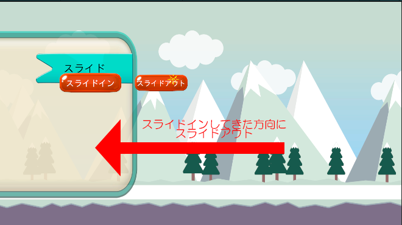
#### falseに設定した場合の動き(スライド方向:右から左の場合)
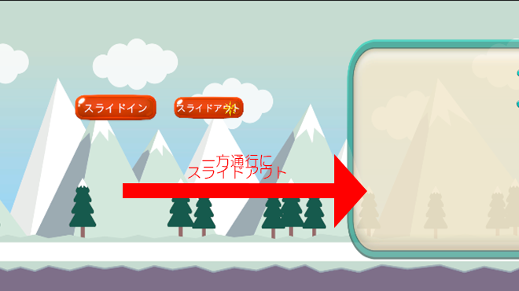

## 4. フェードイン・アウト
- 画面切り替え時等のフェードイン・アウト演出
- ソース : **FadeAnimation.cs** (Scripts/UILib/Animation/FadeAnimation.cs)
- プレファブ : **FadePrefab** (Resources/UILib/Prefabs/FadePrefab)
- ダウンロード : [https://github.com/Kawahara-Rina/UILibrary/releases/download/v1.0.2/04.FadePackage.unitypackage](https://github.com/Kawahara-Rina/UILibrary/releases/download/v1.0.2/04.FadePackage.unitypackage)

#### 主な使用方法
1. Resources/UILib/Prefabs/**FadePrefab**をキャンバス上にドラッグアンドドロップ。
2. FadePrefabにアタッチされている、**FadeAnimation.cs**の透明度の最大値・最小値、アニメーションの速度、フェードタイプ、初めからアニメーションを再生するかを設定。
3. フェードインを行うタイミングで、FadeAnimation.cs.ShowFadeIn()を呼び出す。
    フェードアウトを行うタイミングで、FadeAnimation.cs.ShowFadeOut()を呼び出す。

### インスペクタ上で指定する変数について
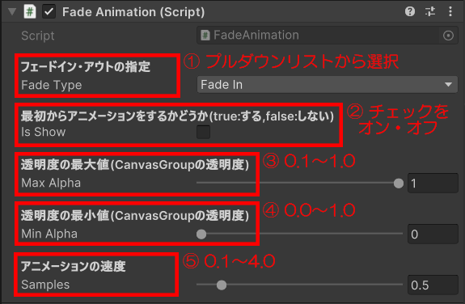　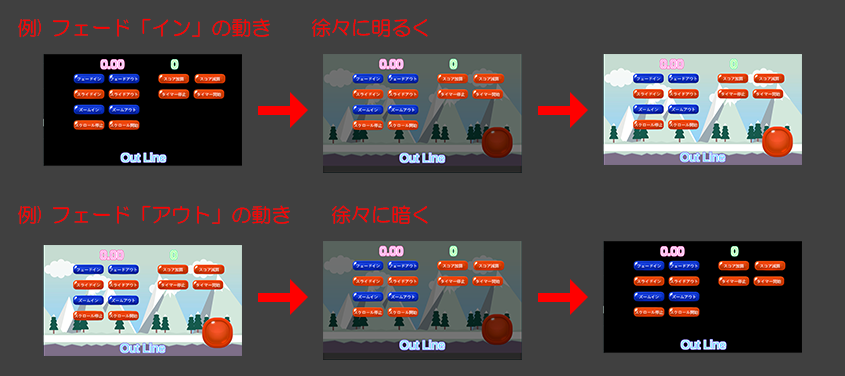
| 変数名     | 型    | 用途                                | 備考                                            |
| ---       | ---   | ---                                 | ---                                             |
| ①fadeType | enum  | フェードタイプ(フェードインかアウトか) | fadeIn : フェードイン fadeOut : フェードアウト |
| ②isShow   | bool  | 初めからアニメーションを再生するか     | true : 初めから再生 false : 初めから再生しない |
| ③maxAlpha | float | 透明度の最大値(CanvasGroupの透明度)   | 0.1~1.0の値 0.1が透明度高、1.0が不透明         |
| ④minAlpha | float | 透明度の最小値(CanvasGroupの透明度)   | 0~1.0の値 0が透明、1.0が不透明                |
| ⑤samples  | float | アニメーションの速度                  | 0.1~4.0の値 0.1が遅い、4.0が速い              |

### 使用時に必要な物
| 必要な物                        | アタッチ先                                            | 備考                                                                         |
| ---                            | ---                                                   | ---                                                                         | 
| FadePrefab                     | -                                                     | 全画面にフェード演出が欲しい場合は、こちらのプレファブを使用することを推奨します。 |
| FadeAnimation.cs               | アニメーションさせたいPanel等のオブジェクト              | -                                                                           |
| 画像                           | 使用するオブジェクトのImageコンポーネント内 Source Image | 任意                                                                         |
| 色                             | 使用するオブジェクトのImageコンポーネント内 Color        | 任意                                                                         |
| Canvas Group                   | アニメーションさせたいPanel等のオブジェクト              | FadePrefabを使用する場合は設定不要です。                                       |
| FadeAnimation.cs.ShowFadeIn()  | フェードインアニメーションを行うタイミングで呼び出し      | ボタン押下時等に呼び出してください。                                            |
| FadeAnimation.cs.ShowFadeOut() | フェードアウトアニメーションを行うタイミングで呼び出し    | ボタン押下時等に呼び出してください。                                            |

## 5. 背景のループ
- 指定した背景画像2枚をループ(スクロール)表示
- ソース : **BgLoopManager.cs** (Scripts/UILib/Manager/BgLoopManager.cs)
- ダウンロード : [(https://github.com/Kawahara-Rina/UILibrary/releases/download/v1.0.2/05.BgLoopPackage.unitypackage)](https://github.com/Kawahara-Rina/UILibrary/releases/download/v1.0.2/05.BgLoopPackage.unitypackage)

#### 主な使用方法
1. 空のオブジェクトを作成(BgLoopManager等)
2. 作成した空のオブジェクトにScripts/UILib/Manager/BgLoopManager.csをアタッチ
3. 空のオブジェクトにアタッチされている、**BgLoopManager.cs**の1枚目の背景、2枚目の背景、スクロールの方向、アニメーションの速度、初めからスクロールをするかを設定。
4. スクロールを開始するタイミングで、BgLoopManager.ScrollStart()を呼び出す。スクロールを停止するタイミングで、BgLoopManager.ScrollStop()を呼び出す。

### インスペクタ上で指定する変数について
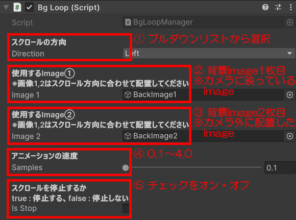
| 変数名      | 型         | 用途                  | 備考                                                          |
| ---        | ---        | ---                   | ---                                                           |
| ①direction | enum       | スクロールの方向       | Up : 上方向 Down : 下方向 Right : 右方向 Left : 左方向 |
| ②image1    | GameObject | ループに使用するImage① | カメラに映っている背景画像1枚目                                  |
| ③image2    | GameObject | ループに使用するImage② | カメラ外の背景画像2枚目                                         |
| ④samples   | float      | アニメーションの速度    | 0.1~4.0の値 0.1が遅い、4.0が速い                            |
| ⑤isStop    | bool       | スクロールを停止       | true : 停止する false : スクロール再開                       |

### 使用時に必要な物
| 必要な物                     | アタッチ先                            | 備考                                                                                                                                   |
| ---                         | ---                                   | ---                                                                                                                                   |
| BgLoopManager.cs            | 空のオブジェクト                       | -                                                                                                                                     |
| Image①                      | BgLoopManager.csのImage1              | カメラに映っている背景画像1枚目を指定してください                                                                                         |
| Image②                      | BgLoopManager.csのImage 2             | カメラ外の背景画像2枚目を指定してください スクロール方向によって座標が異なるため、[こちら](#例-スクロール方向が-左-の場合)を参照してください。 |
| 画像                        | ループ画像2枚                          | 任意                                                                                                                                   |
| BgLoopManager.cs.ScrollStop | スクロールを停止するタイミングで呼び出し | 任意のタイミングで呼び出してください。                                                                                                    |
| BgLoopManager.cs.ScrollStart| スクロールを再開するタイミングで呼び出し | 任意のタイミングで呼び出してください。                                                                                                    |

### 使用時の注意点
1. **Image1、Image2について**
- 背景のスクロール方向によって、Image2の初期座標が異なります。

### 例) スクロール方向が "左" の場合

- Image2のx座標は、画面サイズの横幅分プラスしてください。(1920)
- 逆に、右方向にスクロールする場合は、画面サイズの横幅分マイナスしてください。(-1920) 
  上・下方向についても、上記の関係になるように配置してください。

## 6. タップエフェクト・ロングタップエフェクト
- 画面タップ時・長押し時にエフェクトを表示
- ソース : **TapEffectAnimation.cs、TapEffectManager.cs** (Scripts/UILib/Animation/TapEffectAnimation.cs、Scripts/UILib/Manager/TapEffectManager.cs)
- プレファブ : **TapEffectPrefab** (Resources/UILib/Prefabs/TapEffectPrefab)
- ダウンロード : [https://github.com/Kawahara-Rina/UILibrary/releases/download/v1.0.2/06.TapEffectPackage.unitypackage](https://github.com/Kawahara-Rina/UILibrary/releases/download/v1.0.2/06.TapEffectPackage.unitypackage)

#### 主な使用方法
1. 空のオブジェクトを作成(TapEffectManager等)
2. 作成した空のオブジェクトにScripts/UILib/Manager/TapEffectManager.csをアタッチ
3. 空のオブジェクトにアタッチされている、**TapEffectManager.cs**のエフェクトを表示するキャンバス、タップエフェクトに使用する画像とアニメーションの速度、ロングタップエフェクトに使用する画像とアニメーションの速度・エフェクト生成速度を設定。

### インスペクタ上で指定する変数について
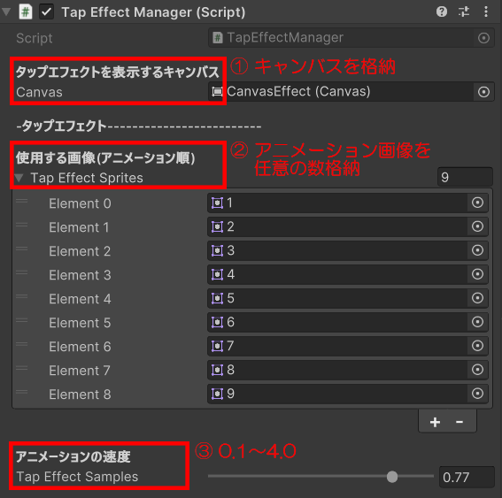
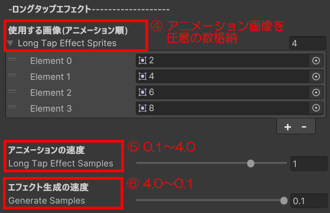
| 変数名                 | 型       | 用途                                            | 備考                              |
| ---                   | ---      | ---                                             | ---                               |
| ①canvas               | Canvas   | エフェクトを表示するキャンバス                     | -                                 |
| ②tapEffectSprites     | Sprite[] | タップエフェクトにアニメーションに使用する画像      | 3~5枚以上を推奨                    |
| ③tapEffectSamples     | float    | タップエフェクトのアニメーションの速度             | 0.1~4.0の値<br4.0が遅い、0.1が速い  |
| ④longTapEffectSprites | Sprite[] | ロングタップエフェクトにアニメーションに使用する画像 | 3~5枚以上を推奨                    |
| ⑤longTapEffectSamples | float    | ロングタップエフェクトのアニメーションの速度        | 0.1~4.0の値 4.0が遅い、0.1が速い |
| ⑥generateSamples      | float    | ロングタップエフェクトの生成間隔                   | 0.1~4.0の値 4.0が遅い、0.1が速い |

### 使用時に必要な物
| 必要な物                   | アタッチ先                                 | 備考                                                                             |
| ---                       | ---                                       | ---                                                                              |
| TapEffectManager.cs       | 空のオブジェクト                            | -                                                                               |
| エフェクトを表示するCanvas  | TapEffectManager.csの canvas              | -                                                                                |
| タップエフェクト用画像      | TapEffectManager.csの tapEffectSprits     | アニメーション用の素材3~5枚以上を推奨。 枚数を指定して、配列の中に格納してください。 |
| ロングタップエフェクト用画像 | TapEffectManager.csの longTapEffectSprits | アニメーション用の素材3~5枚以上を推奨。 枚数を指定して、配列の中に格納してください。 |

## 7. テキストのアウトライン
- テキストに滑らかなアウトラインを付ける
- ソース : **OutLine.cs** (Scripts/UILib/Other/OutLine.cs)
- ダウンロード : [https://github.com/Kawahara-Rina/UILibrary/releases/download/v1.0.2/07.TextOutLinePackage.unitypackage](https://github.com/Kawahara-Rina/UILibrary/releases/download/v1.0.2/07.TextOutLinePackage.unitypackage)

#### 主な使用方法
1. アウトラインを付けたいTextをCanvas上に用意。
2. 用意したTextに**OutLine.cs**をアタッチし、アウトラインの太さ・色を設定。
3. (任意で**OutLine.cs**を重ね付けすることで、より滑らかなアウトラインを生成できます。)

### インスペクタ上で指定する変数について
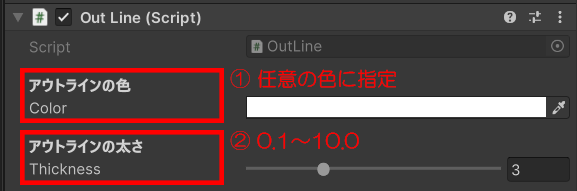　
| 変数名      | 型    | 用途                   | 備考                                  |
| ---        | ---   | ---                    | ---                                  |
| ①thickness | float | アウトラインの太さを指定 | 0.1～10.0の値 0.1が細い、10.0が太い |
| ②color     | Color | アウトラインの色を指定   | -                                    |

### 使用時に必要な物
| 必要な物                | アタッチ先              | 備考 |
| ---                    | ---                    | ---  |
| アウトラインを付けるText | -                      | -    |
| OutLine.cs             | アウトラインを付けるText | -    |

## 8. スコア表示
- スコアを表示し、加算・減算処理を行う
- ソース : **ScoreManager.cs** (Scripts/UILib/Manager/ScoreManager.cs)
- ダウンロード : [https://github.com/Kawahara-Rina/UILibrary/releases/download/v1.0.2/08.ScorePackage.unitypackage](https://github.com/Kawahara-Rina/UILibrary/releases/download/v1.0.2/08.ScorePackage.unitypackage)

#### 主な使用方法
1. 空のオブジェクトを作成(ScoreManager等)
2. 作成した空のオブジェクトにScripts/UILib/Manager/ScoreManager.csをアタッチ
3. 空のオブジェクトにアタッチされている、**ScoreManager.cs**の使用するテキスト、スコアの初期値・上限値・下限値、1回ごとのスコアの加算・減算量、小数点表示を設定。
4. スコアを加算するタイミングで、ScoreManager.CountUpScore()を呼び出す。スコアを減算するタイミングで、ScoreManager.CountDownScore()を呼び出す。 
   スコアの値を使用する場合は、ScoreManager.GetScore()で取得。

### インスペクタ上で指定する変数について

| 変数名         | 型    | 用途                    | 備考                                                                              |
| ---           | ---   | ---                     | ---                                                                               |
| ①text         | Text  | スコアを表示             | -                                                                                 |
| ②score        | float | スコアの初期値           | -                                                                                 |
| ③maxScore     | float | スコアの上限値           | -                                                                                 |
| ④minScore     | float | スコアの下限値           | -                                                                                 |
| ⑤addScore     | float | 1回ごとのスコアへの加算量 | -                                                                                 |
| ⑥subScore     | float | 1回ごとのスコアへの減算量 | -                                                                                 |
| ⑦decimalPlace | enum  | 小数点位置の指定         | None : 小数点以下の表示なし First : 少数第1位まで表示 Second : 少数第2位まで表示 |

### 使用時に必要な物
| 必要な物                        | アタッチ先                          | 備考                                 |
| ---                            | ---                                | ---                                  |
| ScoreManager.cs                | 空のオブジェクト                     | -                                   |
| スコアを表示するText            | ScoreManager.csのtext               | -                                   |
| ScoreManager.cs.CountUpScore   | スコアを加算するタイミングで呼び出し   | 任意のタイミングで呼び出してください。 |
| ScoreManager.cs.CountDownScore | スコアを減算するタイミングで呼び出し   | 任意のタイミングで呼び出してください。 |
| ScoreManager.cs.GetScore       | スコアを取得し、使用する場合に呼び出し | 任意のタイミングで呼び出してください。 |

### 使用時の注意点
1. **maxScore,minScoreについて**
- スコアの最大値・最小値の値は、必ず 
  **maxScore > minScore** になるように設定してください。

## 9. タイマー表示
- タイマーを表示し、カウントアップ・ダウン処理を行う
- ソース : **TimerManager.cs** (Scripts/UILib/Manager/TimerManager.cs)
- ダウンロード : [https://github.com/Kawahara-Rina/UILibrary/releases/download/v1.0.2/09.TimerPackage.unitypackage](https://github.com/Kawahara-Rina/UILibrary/releases/download/v1.0.2/09.TimerPackage.unitypackage)

#### 主な使用方法
1. 空のオブジェクトを作成(TimerManager等)
2. 作成した空のオブジェクトにScripts/UILib/Manager/TimerManager.csをアタッチ
3. 空のオブジェクトにアタッチされている、**TimerManager.cs**の使用するテキスト、タイマーの初期値・停止値、1秒ごとのタイマーへの加算量、カウントの種類、タイマーを停止するか、小数点表示を設定。
4. タイマーを開始するタイミングで、TimerManager.CountStart()を呼び出す。タイマーを停止するタイミングで、TimerManager.CountStop()を呼び出す。 タイマーの値を使用する場合は、TimerManager.GetTimer()で取得。

### インスペクタ上で指定する変数について
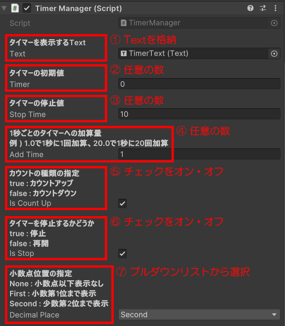
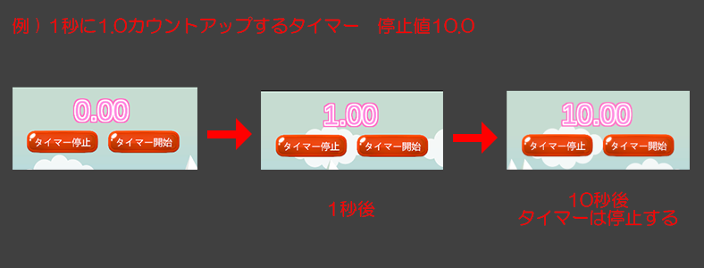
| 変数名         | 型    | 用途                      | 備考                                                                              |
| ---           | ---   | ---                       | ---                                                                               |
| ①text         | Text  | タイマーを表示             | -                                                                                 |
| ②timer        | float | タイマーの初期値           | -                                                                                 |
| ③stopTime     | float | タイマーの停止値           | -                                                                                 |
| ④addTime      | float | 1秒ごとのタイマーへの加算量 | -                                                                                 |
| ⑤isCountUp    | bool  | カウントの種類             | -                                                                                 |
| ⑥isStop       | bool  | タイマーの停止・開始       | -                                                                                  |
| ⑦decimalPlace | enum  | 小数点位置の指定           | None : 小数点以下の表示なし First : 少数第1位まで表示 Second : 少数第2位まで表示 |

### 使用時に必要な物
| 必要な物                   | アタッチ先                            | 備考                                |
| ---                       | ---                                   | ---                                |
| TimerManager.cs           | 空のオブジェクト                       | -                                   |
| タイマーを表示するText      | TimerManager.csのtext                | -                                   |
| TimerManager.cs.CountStart| タイマーを開始するタイミングで呼び出し   | 任意のタイミングで呼び出してください。 |
| TimerManager.cs.CountStop | タイマーを停止するタイミングで呼び出し   | 任意のタイミングで呼び出してください。 |
| TimerManager.cs.GetTimer  | タイマーを取得し、使用する場合に呼び出し | 任意のタイミングで呼び出してください。 |

